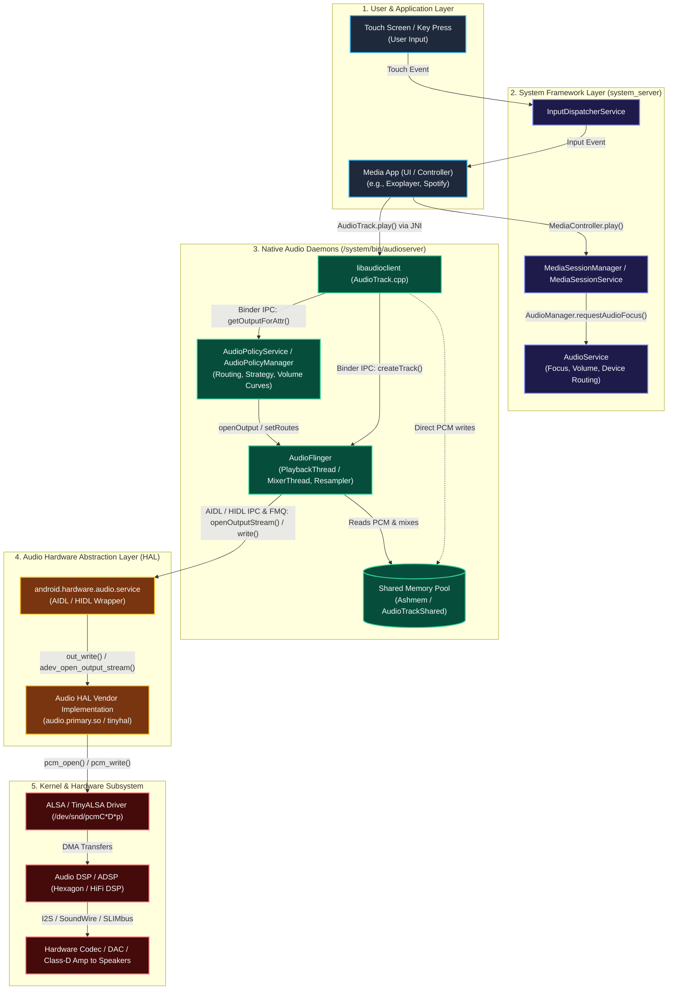
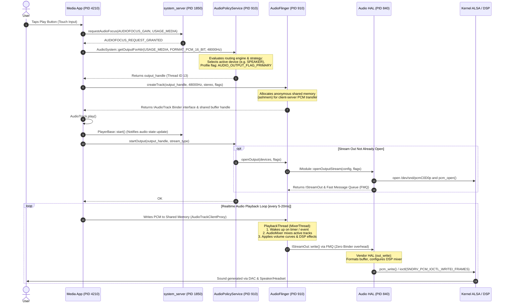

# Android Audio Message Flow: Media Service to Audio HAL

This document provides a comprehensive technical walkthrough and simulation of the message and data flow in the Android Audio Architecture when a user triggers playback (e.g., tapping "Play" in a media app).

---

## 1. High-Level Architectural Flowchart

The following block diagram illustrates the path user input traverses from physical hardware through the Android framework, native daemons, HAL, and the kernel audio subsystem:



---

## 2. Detailed Message Propagation Sequence Diagram

This sequence diagram details every cross-process call, IPC interaction, and control/data plane split from user interaction to hardware sound output.



---

## 3. Simulated Android Logcat Trace

Below is a realistic, timestamped Android `logcat -v time` simulation capturing the exact event propagation across the different processes during playback initialization and steady-state streaming.

```logcat
--------- beginning of system
09-28 21:40:30.102  1850  2104 D InputDispatcher: Delivering touch to (com.example.musicplayer/com.example.musicplayer.MainActivity): action=ACTION_UP, x=540.0, y=1420.0
09-28 21:40:30.110  4210  4210 I MediaSession: dispatchMediaButtonEvent: KeyEvent { action=ACTION_DOWN, keyCode=KEYCODE_MEDIA_PLAY }
09-28 21:40:30.112  4210  4210 D MediaSessionCompat: Handling Play request from UI controller

--------- beginning of main
09-28 21:40:30.115  1850  2450 I AudioManager: requestAudioFocus() from uid/pid 10184/4210 clientId=android.media.AudioManager@48ac212 callingPack=com.example.musicplayer req=1 flags=0x0
09-28 21:40:30.118  1850  2450 D AudioService: requestAudioFocus: granted focus to android.media.AudioManager@48ac212
09-28 21:40:30.125  4210  4280 V AudioTrack: AudioTrack::set(): streamType -1, sampleRate 48000, format 0x1 (PCM_16), channelMask 0x3 (STEREO), frameCount 4096, flags 0x4
09-28 21:40:30.126  4210  4280 D AudioSystem: getOutputForAttr() usage=1 (USAGE_MEDIA) content=2 (CONTENT_TYPE_MUSIC) flags=0x4 tags=
09-28 21:40:30.128   910  1142 I AudioPolicyManager: getOutputForAttr() attributes={ content: MUSIC, usage: MEDIA, flags: 0x4 }
09-28 21:40:30.130   910  1142 D AudioPolicyManager: getOutputForAttr() selected profile: AUDIO_OUTPUT_FLAG_PRIMARY, output handle: 13, device: AUDIO_DEVICE_OUT_SPEAKER (0x2)

09-28 21:40:30.132   910  1142 I AudioFlinger: createTrack() sessionId 45, streamType 3, sampleRate 48000, format 0x1, channelMask 0x3, frameCount 4096, flags 0x4
09-28 21:40:30.135   910  1142 D AudioFlinger: PlaybackThread::createTrack_l() allocated Track 125, name 4097, out of MemoryDealer ashmem buffer (size 32768 bytes)
09-28 21:40:30.138  4210  4280 I AudioTrack: createTrack_l() successful: track 125, output 13, session 45

09-28 21:40:30.142  4210  4280 D AudioTrack: start() track 125 [session 45]
09-28 21:40:30.144  1850  2450 I PlayerBase: player 125 state changed to: STARTED (event=2)
09-28 21:40:30.145   910  1142 I AudioPolicyManager: startOutput() output 13, stream 3, session 45
09-28 21:40:30.146   910  1142 D AudioPolicyManager: startOutput() incrementing active track count on output 13 (count=1)

--------- beginning of hal
09-28 21:40:30.148   910  1142 I AudioFlinger: openOutputStream() handle 13, device 0x2 (AUDIO_DEVICE_OUT_SPEAKER), flags 0x4
09-28 21:40:30.150   840  1012 I audio.primary.device: adev_open_output_stream: req_sample_rate 48000, fmt 0x1, channels 0x3, address '', flags 0x4
09-28 21:40:30.152   840  1012 D audio_hw_primary: select_devices: output device: speaker (id: 2)
09-28 21:40:30.154   840  1012 D audio_hw_primary: apply_audio_route: applying card 0, path 'speaker-playback'
09-28 21:40:30.156   840  1012 I tinyalsa: pcm_open: card=0 device=0 flags=0x10000002 (PCM_OUT | PCM_MONOTONIC)
09-28 21:40:30.158   840  1012 D tinyalsa: pcm_open: pcm_param config: channels=2, rate=48000, period_size=960, period_count=4
09-28 21:40:30.160   910  1142 I AudioFlinger: PlaybackThread 13 (MixerThread) starting threadLoop

--------- beginning of audio data plane (steady state)
09-28 21:40:30.180   910  1290 V AudioFlinger: PlaybackThread::threadLoop() waking up, mixing 1 active tracks
09-28 21:40:30.181   910  1290 V AudioMixer: process__validate(): track 125, vol 1.000000, 1.000000, format PCM_16_BIT
09-28 21:40:30.182   910  1290 D AudioFlinger: PlaybackThread 13 writing 3840 bytes to HAL via FMQ
09-28 21:40:30.183   840  1015 V audio_hw_primary: out_write: stream=0x7b4a2000, bytes=3840
09-28 21:40:30.184   840  1015 D tinyalsa: pcm_write: wrote 960 frames (3840 bytes) to ALSA device /dev/snd/pcmC0D0p
09-28 21:40:30.200   910  1290 V AudioFlinger: PlaybackThread::threadLoop() cycle complete, sleep time = 19.8ms
```

---

## 4. In-Depth Component Analysis & Message Breakdown

### A. Application to Framework Boundary
1. **User Action:**
   * Tapping the UI triggers `View.performClick()`, calling `MediaController.getTransportControls().play()`.
   * The `MediaSessionRecord` (in `system_server`) notifies the callback registered by the app.
2. **Audio Focus Request:**
   * The application calls `AudioManager.requestAudioFocus()`.
   * `AudioService` verifies audio policies, pauses or ducks conflicting audio streams (e.g., ringtone or other music apps), and returns `AUDIOFOCUS_REQUEST_GRANTED`.

### B. Framework to Native Daemon Boundary (`audioserver`)
1. **`AudioTrack.cpp` & `libaudioclient`:**
   * Bridges Java `AudioTrack` via JNI (`android_media_AudioTrack.cpp`).
   * Queries `AudioPolicyService` using `AudioSystem::getOutputForAttr()`.
2. **`AudioPolicyManager` (Policy Engine):**
   * Decides which hardware output stream should be used (e.g., Primary, Deep Buffer, Low Latency, or Compressed Offload) and which physical device (Speaker, Wired Headset, Bluetooth A2DP).
   * Generates or selects an `audio_io_handle_t` corresponding to an `AudioFlinger::PlaybackThread`.
3. **`AudioFlinger` (Audio Engine):**
   * Executes `createTrack()`.
   * Allocates an anonymous shared memory segment (`ashmem` / `MemoryDealer`).
   * Creates an `AudioTrackServerProxy` and returns an `AudioTrackClientProxy` to the application.
   * **Why Ashmem?** Audio data is too high-throughput and sensitive to latency to be copied over standard Binder transactions on every buffer tick.

### C. Native `audioserver` to Audio HAL Boundary (AIDL / HIDL)
Android transitioned from HIDL (`android.hardware.audio@7.x`) to AIDL (`android.hardware.audio.core`) starting in Android 13/14.

1. **Control Plane (Standard Binder):**
   * Methods like `openOutputStream()`, `setParameters()`, `setVolume()`, and `close()` execute via standard IPC Binder calls.
2. **Data Plane (Fast Message Queue - FMQ):**
   * Instead of passing audio buffers over Binder IPC, Android uses **FMQ (Fast Message Queue)** or ashmem ring buffers.
   * An atomic synchronization futex wakes up the HAL thread whenever `AudioFlinger` finishes mixing a block of frames.
   * Guarantees deterministic, real-time audio latency (sub-10ms for fast/low-latency tracks).

### D. Audio HAL to Kernel ALSA Boundary
1. **Vendor HAL Implementation (`audio.primary.so`):**
   * Implements `adev_open_output_stream()` and `out_write()`.
   * Configures audio mixer controls using `tinymix` or custom sysfs nodes to enable amplifier chips, adjust analog gains, and configure routing paths.
2. **TinyALSA:**
   * Calls `pcm_open()` on `/dev/snd/pcmC0D0p` (Card 0, Device 0, Playback).
   * Issues standard `ioctl()` calls (`SNDRV_PCM_IOCTL_PREPARE`, `SNDRV_PCM_IOCTL_WRITEI_FRAMES`).
3. **Kernel ALSA & DSP Drivers:**
   * DMA controller copies audio frames to DSP memory or directly to the hardware audio codec.
   * DAC (Digital-to-Analog Converter) produces analog electrical signals routed to speaker transducers.

---

## 5. Summary Matrix of Protocols and Interfaces

| Boundary | Control Plane Mechanism | Data Plane Mechanism | Typical Latency Impact |
| :--- | :--- | :--- | :--- |
| **App ↔ system_server** | Android Binder (`IAudioService`) | None (State & focus only) | Negligible (~0.5ms) |
| **App ↔ audioserver** | Binder (`IAudioPolicyService`, `IAudioFlinger`) | Anonymous Shared Memory (`ashmem`) | Zero-copy buffer fill |
| **AudioFlinger ↔ Audio HAL** | AIDL Binder (`IModule`, `IStreamOut`) | Fast Message Queue (FMQ) ring buffer | < 0.2ms synchronization |
| **Audio HAL ↔ Linux Kernel** | Direct `ioctl` (`/dev/snd/pcm*`) | ALSA DMA / Ring Buffer | Hardware Period (~5-20ms) |
